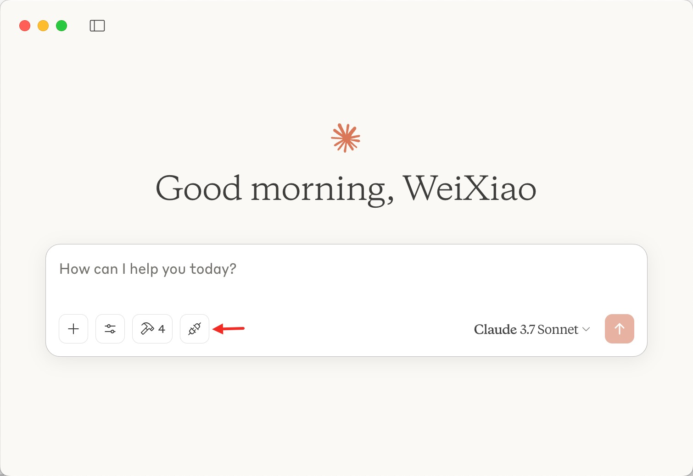

# mcp-oceanbase
OCP (OceanBase Cloud Platform) MCP Server.

[English](ocp_mcp_server.md) | 简体中文

## 使用方式

配合 MCP Client 使用，必须使用支持 Prompt 的客户端，如：Cluade Desktop。输入请求前需要手动选取所需的 Prompt，然后输入请求。



Claude Desktop config  example:

```json
 "ocp": {
            "command": "{python or uv}",
            "args": [
              "{Your path}/mcp-oceanbase/src/ocp_mcp_server/server.py"
            ],
            "env": {
              "AK": "******",
              "SK": "******",
              "ADDRESS":"ip:port"
            }
          }
```

## 社区

当你需要帮助时，你可以在 [https://ask.oceanbase.com](https://ask.oceanbase.com) 上找到开发者和其他的社区伙伴。

当你发现项目缺陷时，请在 [issues](https://github.com/oceanbase/mcp-oceanbase/issues) 页面创建一个新的 issue。

## 许可证

更多信息见 [LICENSE](LICENSE)。