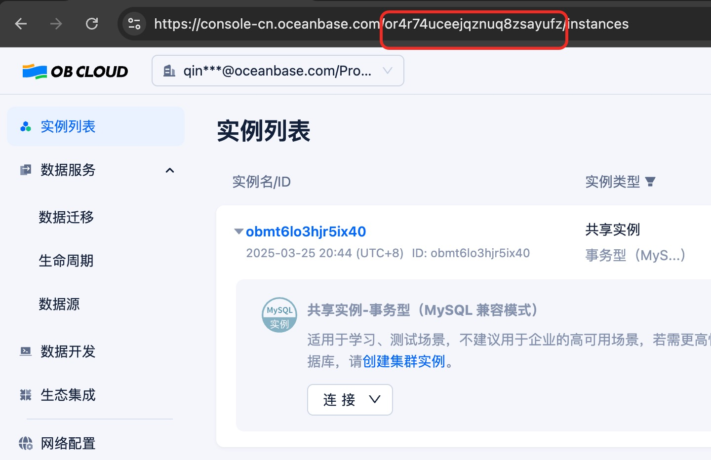

## obcloud-mcp-server

MCP Server for [OBCloud](https://console-cn.oceanbase.com)

## Env

| variable | description                   |
| -------- | ----------------------------- |
| project  | your OBCloud project id       |
| username | your OBCloud account name     |
| password | your OBCloud account password |

## Tools

| name           | description                                 |
| -------------- | ------------------------------------------- |
| list_instances | list oceanbase instances                    |
| list_tenants   | describe tenants by instance id             |
| list_databases | describe databases by teant id              |
| connect        | create connection to oceanbase database     |
| diagnostics    | Diagnose the operational status of a tenant |
| query          | query infos from tenant's database by sql   |

## Prepare

You need an OceanBase account to use this tool. If you don't have one yet, you can visit [OBCloud](https://console-cn.oceanbase.com) to register for it.
then login your OBCloud account, and get your project id in navigate url



## Usage

the config for MCP Client like:

```json
 "obcloud-mcp-server": {
            "command": "npx",
            "args": [
              "-y",
              "@oceanbase/obcloud-mcp-server"
            ],
            "env": {
              "username": "******",
              "password": "******",
              "project":"******",
            }
          }
```

when mcp server connect success,then you can use it 


you can use this prompt to test your OBCloud workflow:

```
用中文回答，引导用户:
1.检查是否存在 instances 资源，如果不存在，尝试请求资源后展示。
2.让用户选择某一个实例。
3.列出该实例下所有的租户。
4.让用户选择某一个租户。
5.尝试对租户进行诊断
6.列出该实例下所有的数据库。
7.让用户选择某一个数据库。
8.让用户输入数据库连接的账号和密码后，尝试连接数据库
```


                
